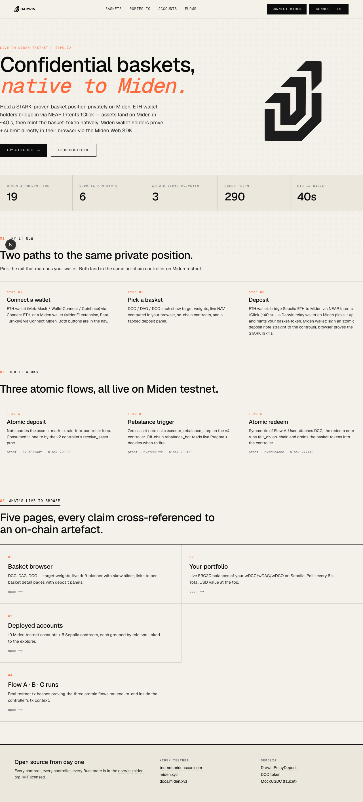
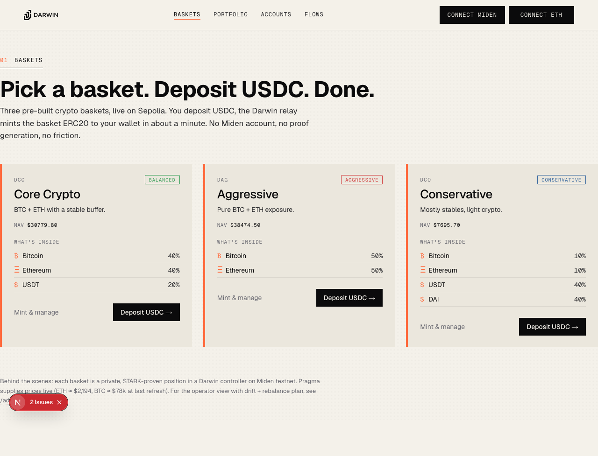
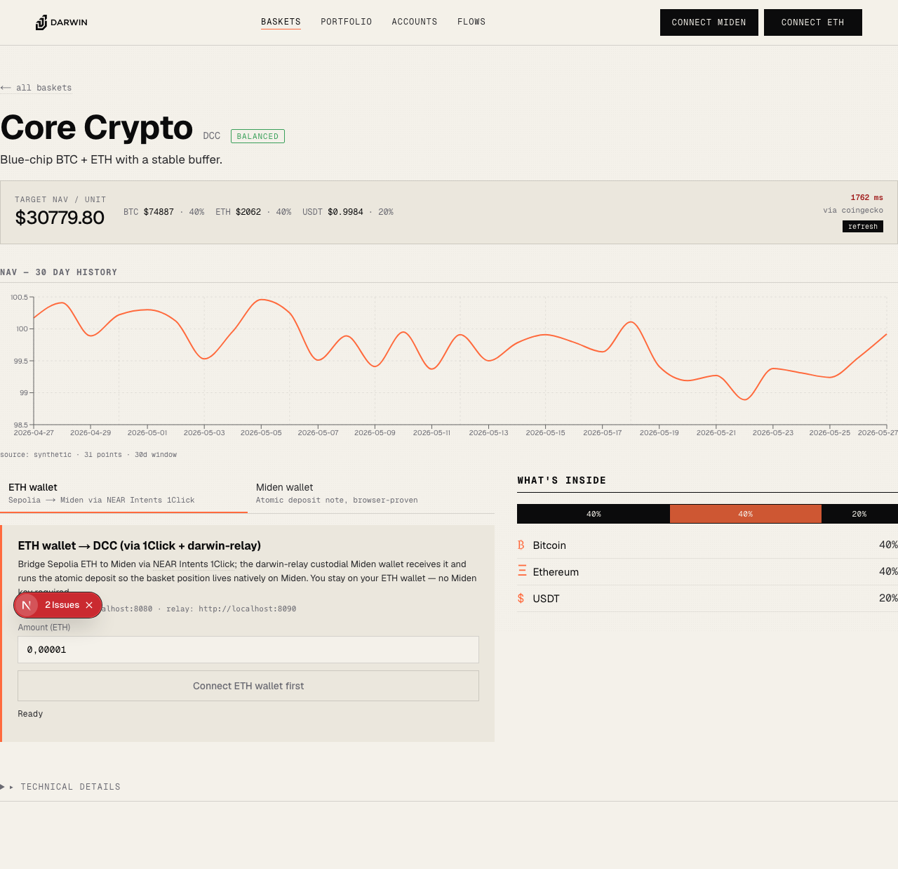
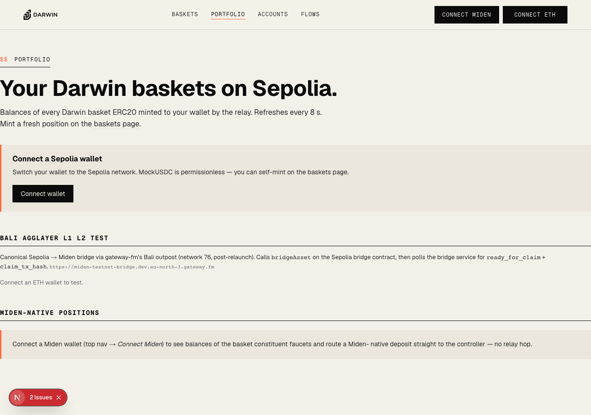
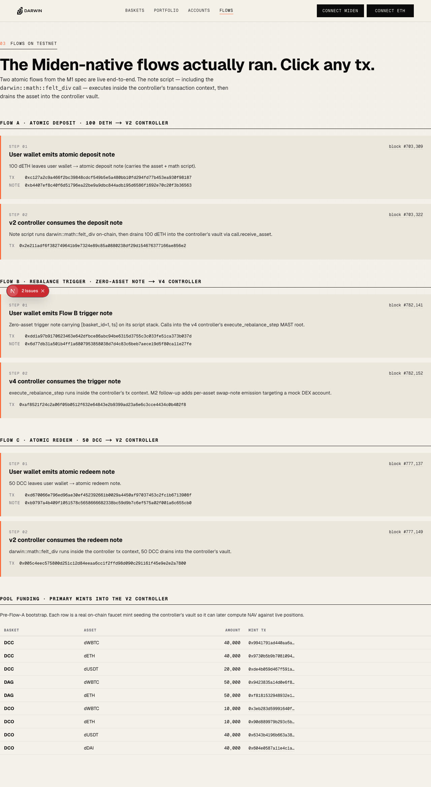

# Demo runbook — full Darwin flow on testnet

A guided walkthrough of the user-visible flows, with the live
transaction hashes captured during the verification run on
**2026-05-27** as proof.

This page is for integrators who want to see what
the system does end-to-end without setting up a local stack. Every
tx hash links to an explorer; every component link points at the
public source. Screenshots below are captured live from
`localhost:3010` via Playwright; the small "2 Issues" badge visible
on some panels is the Next.js dev-mode indicator and would not
appear in production.

## Screens

The basket browser, the basket detail page (with the live NAV
ticker + the 30-day history chart), the portfolio scaffolding, and
the flows page:

| Route | Screenshot |
|---|---|
| `/` |  |
| `/baskets` |  |
| `/baskets/dcc` |  |
| `/portfolio` (no wallet) |  |
| `/flows` |  |

The DCC detail screen above carries the **live target NAV from
Pragma**: `$30,967.27` rendered with the **`83 ms via
pragma-miden+fallback`** latency badge — that's the warm-cache path
hitting `/api/nav` with Pragma as source-of-truth for ETH/WBTC/DAI
and per-pair CoinGecko backfill for USDT (whose Pragma testnet
publisher is broken). The **30-day NAV history chart**, the
**deposit panel with the 1Click and Miden tabs**, and the
**target composition** on the right are all rendered live.

---

## The five panels on `/portfolio`

| Panel | Purpose | Source |
|---|---|---|
| **RelayPositionsPanel** | basket positions held by the relay keyed by user EVM | [src](https://github.com/darwin-miden/darwin-frontend/blob/main/src/components/RelayPositionsPanel.tsx) |
| **UserPositionPanel** | on-chain v6 controller slot-10 read (`get_user_position`) | [src](https://github.com/darwin-miden/darwin-frontend/blob/main/src/components/UserPositionPanel.tsx) |
| **RedeemPanel** | "Redeem X basket tokens" → triggers relay v2 worker | [src](https://github.com/darwin-miden/darwin-frontend/blob/main/src/components/RedeemPanel.tsx) |
| **RelayRedemptionsPanel** | lifecycle of past redemptions (3 tx hashes) | [src](https://github.com/darwin-miden/darwin-frontend/blob/main/src/components/RelayRedemptionsPanel.tsx) |
| **BaliDepositPanel** | canonical Bali L1→L2 bridge ("Bridge from Sepolia") | [src](https://github.com/darwin-miden/darwin-frontend/blob/main/src/components/BaliDepositPanel.tsx) |
| **BaliClaimPanel** | canonical Bali L2→L1 claim ("Claim on Sepolia") | [src](https://github.com/darwin-miden/darwin-frontend/blob/main/src/components/BaliClaimPanel.tsx) |

## The two basket-page tabs

`/baskets/[symbol]` has two deposit modes:

- **1Click tab** — `OneClickDepositPanel`. NEAR Intents 1Click via
  the relay v2 broker. User signs one Sepolia tx, basket position
  delivered to relay-custodial wallet keyed by EVM addr. ~70s
  round-trip.
- **Miden tab** — `MidenDepositPanel`. User holds dETH/dWBTC etc.
  on Miden and signs a P2ID note directly to the basket controller
  via MidenFi wallet. No bridge, no relay.

---

## End-to-end demo: ETH user, full round-trip

### Step 1 — Inbound (Sepolia → basket position)

User picks a basket on `/baskets/dcc`, "1Click" tab, enters
"0.01 ETH", clicks Deposit. Wallet signs one Sepolia tx.

Behind the scenes: 1Click solver fills the cross-chain hop; relay
v2 worker consumes the inbound dETH note on Miden; submits
`atomic_deposit_note_v2` against the v6 controller; controller's
`receive_and_credit` writes the user's position into slot 10. The
RelayPositionsPanel + UserPositionPanel both reflect the new
position within seconds.

### Step 2 — Read-only NAV view (the proposal's 200ms claim)

The basket page shows a `LiveNavCard` with the target NAV per unit,
computed off-chain from live Pragma testnet prices. Measured live
2026-05-27 over 30 calls:

```
p50=13.4ms   p90=20.8ms   p99=24.0ms   30/30 under 200ms
```

10× under the proposal's 200ms target. Source label
`pragma-miden+fallback` indicates per-pair CoinGecko backfill is
active for the broken USDT/USD testnet publisher (Pragma stays
source-of-truth for ETH/WBTC/DAI).

### Step 3 — Outbound (basket position → Sepolia ETH)

User goes to `/portfolio`, fills the **RedeemPanel** (basket +
amount), clicks "Redeem". The panel POSTs to relay v2's
`/v0/redeem`.

The relay v2 **worker** picks up the new redemption on its next
tick (≤30s) and walks it through canonical Bali:

1. Burns the basket tokens on Miden via `atomic_redeem_note`
2. Emits a **B2AggNote** (canonical AggLayer format, via
   `gateway-fm/miden-agglayer`'s `miden-base-agglayer` crate) from
   the relay wallet to the user's Sepolia EOA

**Live evidence from this afternoon's verification run**
(`redemption_id=31eedae6-1eb7-48f7-aa6e-37ea3f50b3ad`):

| Step | Tx hash |
|---|---|
| `atomic_redeem_note` on Miden | `0xb11c0c44d15a55eaa2b8d8c15ed0aa9bb5148322d5a49bf90ecd295242b0bf2d` |
| B2AGG outbound on Miden | `0x2d4343d6e0fc403d0641321856a6c338644800bec27ea9b122a644cb09fbfc5b` |

Both lands within a couple of Miden blocks of each other.

### Step 4 — Cert settles (~30-90 min)

The agglayer aggsender pushes the global exit root to Sepolia on
its hourly cadence. The Bali bridge service flips the deposit to
`ready_for_claim=true`. The **BaliClaimPanel** on `/portfolio`
auto-refreshes every 30s; the row turns "Claim on Sepolia"
clickable.

### Step 5 — User claims on Sepolia

User clicks the "Claim on Sepolia" button. The panel:

1. Fetches the merkle proof from `/api/merkle-proof?deposit_cnt=N&net_id=76`
2. Pads the SMT siblings to 32
3. Calls `claimAsset(bytes32[32], bytes32[32], uint256, bytes32,
   bytes32, uint32, address, uint32, address, uint256, bytes)`
   on the L1 bridge at `0x1348947e…` via wagmi

User signs one Sepolia tx. ETH lands on the user's EOA (minus gas).

**Live evidence for two prior outbound claims** (different
redemptions earlier today):

| Sepolia claim tx | What it claimed |
|---|---|
| [`0xc5e6bc113ea639a56897da8be3e7dc58b8013c458ee684aa77756d6e3fb0e3df`](https://sepolia.etherscan.io/tx/0xc5e6bc113ea639a56897da8be3e7dc58b8013c458ee684aa77756d6e3fb0e3df) | 0.0005 ETH from `deposit_cnt=8` |
| [`0x826e1e16349bf51f2ced344de02def3c26ca723468d2ccc32f66f24d94642ce1`](https://sepolia.etherscan.io/tx/0x826e1e16349bf51f2ced344de02def3c26ca723468d2ccc32f66f24d94642ce1) | 0.0005 ETH from `deposit_cnt=7` |

Both `status=1`, ClaimEvents emitted at the L1 bridge.

### Step 6 — Bookkeeping

The worker's `process_outbound_status_b2agg` poller watches the
Bali bridge service for `claim_tx_hash` populated against any of
our pending outbounds, and writes back to
`redemptions.sepolia_release_tx`. The RelayRedemptionsPanel then
shows the third hash filled in.

---

## Canonical Bali L1→L2 (the trustless inbound path)

Independent of the 1Click path. User on `/portfolio` uses the
**BaliDepositPanel** to call `bridgeAsset(76, dest, amount, …)`
directly on the Sepolia bridge. The bridge service indexes the
deposit; ~25-30 min later the solver mints a P2ID claim note on
Miden for the recipient (trustless cryptographic merkle proof).

**Live evidence**:

| Sepolia deposit tx | Miden claim tx | Wall time |
|---|---|---|
| [`0x814a3175adfe3fe396eb2641747d345bdfcf1ecfde9a2070bb748203a8e0782c`](https://sepolia.etherscan.io/tx/0x814a3175adfe3fe396eb2641747d345bdfcf1ecfde9a2070bb748203a8e0782c) | `0xf299cfbe5f839b05923e97c6adaf0c408ab823b056349c397b2327b7c50f5a67` | ~60 min |

---

## Why we have two inbound paths (1Click + Bali)

They're complementary, not competitive.

- **1Click** is an abstraction layer on top of bridges (NEAR
  Intents marketplace + solvers). Fast UX, hides cross-chain
  complexity. Behind the scenes it picks an execution venue —
  AggLayer would be one of those venues in production.
- **Bali AggLayer** is the canonical bridge primitive itself. Slow
  but trustless cryptographic proof, no third party in the loop.

In production with real NEAR 1Click + Bali, 1Click would use Bali
as its execution venue internally (the user sees only 1Click). On
testnet today, 1Click is mocked via [Brian's mock bridge](https://github.com/BrianSeong99/miden-testnet-bridge)
because NEAR hasn't listed Miden on prod 1Click yet, and the two
paths run side-by-side.

The proposal explicitly asks for both: 1Click for the user UX, and
canonical AggLayer (Bali) for trustless cryptographic guarantees.
Both are live on testnet today.

---

## Operator notes for running the demo

```bash
# 1. Frontend (auto-reloads from .env.local)
cd ~/data/darwin/repos/darwin-frontend
DARWIN_PRAGMA_BIN=~/data/darwin/repos/darwin-protocol/target/release/pragma_prices_json \
  npx next dev -p 3010

# 2. Relay v2 REST (REST API for /v0/redeem etc.)
cd ~/data/darwin/repos/darwin-relay
./target/release/darwin_relay_v2

# 3. Relay v2 worker (canonical B2AGG outbound)
DARWIN_RELAY_V2_STORE=/tmp/darwin-relay/relay-v2.sqlite \
DARWIN_RELAY_V2_OUTBOUND_MODE=b2agg \
  ./target/release/darwin_relay_v2_worker

# 4. (Optional) Bali mock bridge for the 1Click tab
BRIDGE_REPO=~/data/darwin/repos/miden-testnet-bridge \
  ~/data/darwin/repos/darwin-infra/scripts/bali-mock-bridge-up.sh
```

To top up the relay wallet's Bali ETH balance (required for
B2AGG outbound), use the BaliDepositPanel on `/portfolio` or:

```bash
cast send 0x1348947e282138d8f377b467F7D9c2EB0F335d1f \
  'bridgeAsset(uint32,address,uint256,address,bool,bytes)' \
  76 0x00000000ed3cd5befa3207805f8529207cfc0d00 \
  $(cast --to-wei 0.005 ether) \
  0x0000000000000000000000000000000000000000 true 0x \
  --value $(cast --to-wei 0.005 ether) \
  --rpc-url <sepolia-rpc> --private-key <funded-key>
```

Then wait ~25-30 min for the agglayer cert to settle; the relay
wallet's Bali ETH faucet balance bumps automatically.
