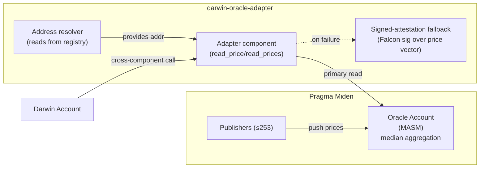
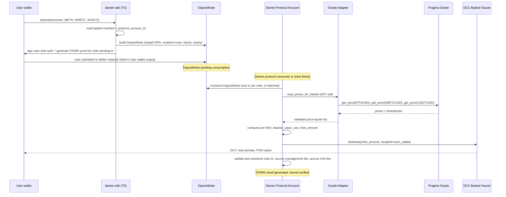
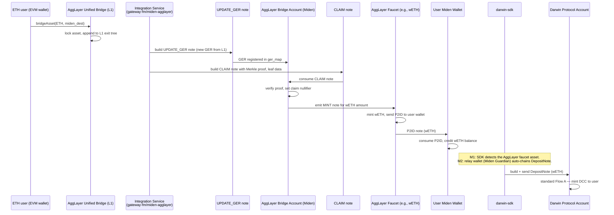

# Darwin Protocol — Milestone 1 Architecture Specification

> **Confidential basket protocol on Miden.** This document specifies the Miden core layer delivered under Milestone 1 of the Darwin x Miden grant. It is the technical contract between the Darwin team and the Miden ecosystem, and the reference for the M1 test report.

---

## 1. Executive Summary

Darwin is a **confidential basket protocol** that allows users to deposit underlying crypto assets and receive a single basket token whose Net Asset Value (NAV) tracks a weighted index. All basket operations run **natively on Miden** with **client-side STARK proofs**, so individual positions, balances, and NAV remain private by default.

**Milestone 1 delivers the core Miden layer on testnet:**

- One **Darwin Protocol Account** per basket (`RegularAccountImmutableCode`, `StorageMode::Private`) holds the shared pool of underlyings, the basket logic, target weights, NAV, and fee state in a `StorageMap`. Users do **not** deploy their own Darwin account; they interact with the protocol account by sending `DepositNote`s from their personal Miden wallet.
- **Basket token mint and burn** are implemented natively on Miden as `FungibleFaucet` components, with STARK-proven note consumption. Each basket token is fungible across all users of that basket and held in their personal Miden wallets. Each basket faucet additionally implements the `agglayer_faucet` interface so the basket token is bridgeable out to Ethereum.
- **Three curated baskets** are deployed and validated end-to-end on testnet:
  - **B1 — Core Crypto (DCC):** WBTC 40 / ETH 40 / USDT 20
  - **B2 — Aggressive (DAG):** WBTC 50 / ETH 50
  - **B3 — Conservative (DCO):** WBTC 10 / ETH 10 / USDT 40 / DAI 40
- **Both note scripts** are implemented in M1: `DepositNote` (mint flow) and `RedeemNote` (burn flow, pro-rata distribution of underlyings). The end-to-end Flow C user experience for ETH users (round-trip through AggLayer back to an EVM wallet) is delivered in M2.
- **Pragma Oracle** is integrated for private NAV computation, reading price feeds inside the transaction circuit, with a signed-attestation fallback in case the testnet oracle is unavailable.
- **AggLayer Bridge integration** ships against the `v0.14-alpha` `miden-agglayer` crate from `0xMiden/protocol` (branch `next`): Darwin implements the `B2AGG` note construction in the SDK (bridge any basket token out to Ethereum), enhances each basket faucet with the `agglayer_faucet::asset_to_origin_asset` interface, and supports inbound bridged assets via `CLAIM` note infrastructure. Whether the full L1↔Miden round-trip is exercised end-to-end depends on whether Miden ships the canonical bridge on public testnet during the M1 window; if not, the L1 leg is exercised against the `gateway-fm/miden-agglayer` docker-compose stack and documented as a partial-stub flow.
- **Flow A (Miden-native deposit)** is functional end-to-end on testnet for all three baskets, from `DepositNote` creation through STARK proof verification by the Transaction Kernel to basket token minting.

**Out of scope for M1 and deferred to later milestones:**

- **ETH user UX** (Near Intent + Miden Guardian relay wallet) → **M2**. The asset-level AggLayer bridge primitives *are* in M1; the end-user flow that lets an EVM-wallet user deposit without ever touching Miden directly is in M2.
- **Flow C end-to-end UX for ETH users** → **M2**. M1 ships the `RedeemNote` script and its consumption logic (pro-rata distribution of underlyings to a Miden recipient). M2 chains the AggLayer bridge-out so ETH users automatically receive the underlyings on their EVM wallet.
- Automated rebalancing engine and in-protocol DEX execution → **M2**
- Frontend at `darwin.xyz` and mainnet deployment → **M3**

**M1 budget and timeline:** $10,000, 1.5 months.

---

## 2. Context, Scope & Constraints

### 2.1 Grant Context

This specification implements **Milestone 1** of the Darwin x Miden grant proposal signed in March 2026. The proposal commits to deploying Darwin's core protocol layer on Miden testnet and validating the deposit/mint flow with at least one curated basket. The two subsequent milestones (M2: cross-chain user paths and rebalancing; M3: frontend and mainnet) build on the foundations laid here.

### 2.2 In-Scope Components

| Component | M1 Scope | Repo |
|---|---|---|
| Darwin Protocol Accounts (3 instances, one per basket) | Full implementation, testnet deployment | `darwin-protocol` |
| Custom Darwin asset faucets (`darwin-eth`, `darwin-wbtc`, `darwin-usdt`, `darwin-dai`) | Full implementation | `darwin-protocol` |
| Three basket token faucets (DCC, DAG, DCO) | Mint and burn procedures full + unit-tested. Each faucet implements the `agglayer_faucet::asset_to_origin_asset` interface so the basket token is bridgeable to Ethereum via AggLayer. | `darwin-protocol` |
| `DepositNote` script | Full implementation (Flow A mint) | `darwin-protocol` |
| `RedeemNote` script | **Full implementation** (consumed by Darwin Protocol Account, pro-rata distribution + basket-token burn). End-to-end Flow C UX for ETH users (round-trip through AggLayer) is M2. | `darwin-protocol` |
| `B2AGG` note construction (Bridge-to-AggLayer) for all 3 basket tokens | Full implementation in SDK + integration test against `v0.14-alpha` bridge | `darwin-sdk`, `darwin-bridge-adapter` |
| `CLAIM` note handling (AggLayer-to-Miden inbound) for bridged ETH user deposits | Infrastructure full; full L1 round-trip depends on canonical bridge availability — fallback uses `gateway-fm/miden-agglayer` local stack | `darwin-bridge-adapter` |
| Pragma Oracle adapter (incl. fallback) | Full implementation | `darwin-oracle-adapter` |
| Three basket configurations | Manifests authored, deployed on testnet | `darwin-baskets` |
| Client SDK (Rust + TypeScript) | Wraps `miden-client` v0.14 + `miden-agglayer` v0.14-alpha, proof generation pipeline | `darwin-sdk` |
| Architecture spec (this document) + test report | Delivered as part of M1 | `darwin-docs` |

### 2.3 Out-of-Scope (M1)

- **AggLayer bridge integration.** The Miden v0.14 FAQ explicitly states: *"Miden does not yet have a fully operational bridge, work in progress."* Bridge integration is deferred to M2/M3 once Miden ships canonical bridging primitives. Darwin will expose interface hooks in M1 so that integration is non-invasive when the bridge becomes available.
- **ETH user path** (Near Intent + Miden Guardian relay wallet). M2 deliverable per the proposal.
- **Rebalancing engine.** Drift detection and DEX execution are M2.
- **Frontend.** Server-side proof generation utilities are present in the M1 SDK, but no end-user UI is delivered in M1.

### 2.4 Key Assumptions and Dependencies

| Dependency | Status as of 2026-05-14 | Mitigation |
|---|---|---|
| Miden testnet operational | Live, v0.14.6 (10 May 2026) | Pin client version, monitor breaking changes |
| Pragma Oracle on Miden testnet | Live at `miden.pragma.build`, feeds: BTC/USD, ETH/USD, WBTC/USD, USDT/USD, DAI/USD | Dynamic oracle address resolution; signed-attestation fallback |
| `miden-client` v0.14+ APIs stable enough for production-style use | Stable enough for testnet; resource-based API (`client.accounts`, `client.notes`, `client.transactions`) confirmed in v0.14 | Pin minor version in lockfile |
| `miden-agglayer` v0.14-alpha library | Implemented in `0xMiden/protocol` branch `next`. Bridge, faucet, and note types are spec-complete with cross-chain test vectors. | Pin specific commit of `next` branch in Cargo.toml; track alpha → stable migration |
| Canonical AggLayer bridge deployed on public Miden testnet | **Status unconfirmed as of 2026-05-14.** Per Miden's homepage roadmap, AggLayer bridging dated April 2026. Per Miden v0.14 FAQ, bridge is still listed as "work in progress" — wording may lag the alpha implementation. | Two-track strategy: (a) use canonical bridge if deployed, (b) run `gateway-fm/miden-agglayer` locally for E2E if not. Decision deferred to Miden-team confirmation. |
| `gateway-fm/miden-agglayer` integration service | Public repo, actively maintained (commits 2026-05-14), full docker-compose E2E stack with passing L1↔L2 balance-exact tests | Use docker-compose `e2e` stack for Darwin integration tests; production deployment of this service is outside M1 scope |
| Miden mainnet launch | Targeted early July 2026 | M1 deliverable is testnet, so mainnet timing does not block M1 |

### 2.5 Deltas from the Original Proposal

The proposal was drafted in March 2026 against Miden v0.13 and a pre-flight survey of Pragma and AggLayer. The following deltas were identified during the M1 audit and are accepted by both parties:

1. **Miden client version:** target is **v0.14.x** (not v0.13). v0.14 introduces a breaking change in asset representation (single `ASSET` word → `ASSET_KEY` + `ASSET_VALUE` two-word pair) and a unified `AuthSingleSig` auth scheme.
2. **Pragma feeds:** the proposal listed `(WETH/USD, WBTC/USD, USDC/USD)`. The actual Pragma Miden testnet feeds are `BTC/USD, ETH/USD, WBTC/USD, USDT/USD, DAI/USD`. M1 uses the available feeds; `USDC/USD` is dropped, `USDT` is used in its place.
3. **Pragma latency:** the proposal cited "~200ms". Pragma's public dashboard shows updates **every 10 seconds**. The 200ms figure is interpreted as the in-circuit price read latency, not the publisher update frequency; the test report will document both.
4. **Basket naming:** the proposal lists "Core Crypto, DeFi Blue Chips, Privacy Pack" as example basket names (the proposal uses the ellipsis `(Core Crypto, DeFi Blue Chips, Privacy Coins…)` indicating the names are illustrative). The technical reality is that Pragma Miden testnet does not yet provide feeds for UNI/AAVE/MKR (DeFi Blue Chips) or ZEC/XMR (Privacy Pack), and no cross-chain bridging primitives are available for non-EVM privacy assets. **Darwin still ships three baskets**, but their compositions and names are adapted to the four assets backed by live Pragma feeds (WBTC, ETH, USDT, DAI). The three M1 baskets are: **B1 Core Crypto**, **B2 Aggressive**, **B3 Conservative**. The original-name baskets (DeFi Blue Chips, Privacy Pack) are revisited in M2/M3 if/when their feeds and bridging primitives become available.
5. **AggLayer BridgeAsset:** *kept* as an M1 deliverable but scoped pragmatically. The `miden-agglayer` v0.14-alpha library in `0xMiden/protocol` makes the asset-bridging primitives implementable today. M1 ships: B2AGG note construction in the SDK, each basket faucet's `agglayer_faucet::asset_to_origin_asset` interface, and CLAIM-note infrastructure for inbound bridged assets. What M1 does *not* guarantee is the full live L1↔Miden round-trip — that is contingent on Miden deploying the canonical bridge on public testnet. If the canonical bridge is not live during the M1 validation window, the L1 leg is exercised against the `gateway-fm/miden-agglayer` docker-compose stack and the resulting partial-stub flow is documented in the test report.

---

## 3. System Architecture

### 3.1 High-Level Diagram

```mermaid
flowchart TB
  subgraph User["User (Miden wallet)"]
    Wallet["Personal Miden Wallet<br/>(holds DCC + underlyings)<br/>client-side proving"]
  end

  subgraph SDK["darwin-sdk"]
    SDKRust["Rust SDK<br/>(WASM-able)"]
    SDKTs["TypeScript SDK<br/>(miden-client v0.14)"]
  end

  subgraph Miden["Miden testnet"]
    DepositNote["DepositNote<br/>(NoteScript)"]
    DAccount["Darwin Protocol Account<br/>(one per basket)<br/>RegularAccountImmutableCode<br/>StorageMode::Private"]
    BasketFaucet["Core Crypto Faucet<br/>(FungibleFaucet, DCC)<br/>owned by protocol account"]
    AssetFaucets["Darwin asset faucets<br/>darwin-eth, darwin-wbtc, darwin-usdt"]
    Kernel["Transaction Kernel<br/>(STARK verify)"]
    Pragma["Pragma Oracle Account<br/>(median aggregation)"]
  end

  subgraph Oracle["darwin-oracle-adapter"]
    Adapter["Pragma adapter<br/>+ fallback"]
  end

  Wallet -->|uses| SDKTs
  SDKTs -->|builds + signs| DepositNote
  DepositNote -->|consumed by| DAccount
  DAccount -->|reads price| Adapter
  Adapter -->|primary| Pragma
  Adapter -.->|fallback signed| DAccount
  DAccount -->|mint call| BasketFaucet
  DAccount -->|holds the pool| AssetFaucets
  DAccount -->|emits proof| Kernel
  BasketFaucet -->|DCC note (private)| Wallet
```

The protocol account is **shared**: every user's deposit consumes against the same account state. Privacy comes from `StorageMode::Private` on the protocol account (only commitments published), from `Private` notes (only consumption commitments published), and from users holding DCC in their personal `Private`-mode wallets.

### 3.2 Multi-Repo Architecture

Darwin is organised under the GitHub organisation **[darwin-miden](https://github.com/darwin-miden)**. Repositories follow the convention of the Miden ecosystem (separate `miden-base`, `miden-client`, `miden-node`, …) so that each component can ship and be audited independently.

| Repo | Visibility (M1) | Purpose | Stack |
|---|---|---|---|
| `darwin-protocol` | private | Core MASM: Darwin Protocol Account, basket faucet, asset faucets, note scripts (`DepositNote`, `RedeemNote`), kernel hooks | MASM + Rust (Miden v0.14 Rust compiler) |
| `darwin-sdk` | private | Client SDK wrapping `miden-client` v0.14: account management, note construction, proof generation, NAV helpers | Rust core + TypeScript bindings |
| `darwin-baskets` | private | Versioned basket manifests (composition, weights, rebalancing rules, fees) and the Rust loader used by the protocol and the SDK | TOML/JSON + Rust loader |
| `darwin-oracle-adapter` | private | Pragma adapter (dynamic oracle resolution) + signed-attestation fallback | MASM + Rust |
| `darwin-bridge-adapter` | private | Stubs and interface hooks for future AggLayer integration | Solidity + Rust (scaffold only in M1) |
| `darwin-infra` | private | Docker-compose for local dev, GitHub Actions workflows, deployment scripts | YAML + shell |
| `darwin-docs` | **public** | Architecture specs (this document), litepaper, integration guide. Public vitrine. | Markdown + Docusaurus |
| `darwin-frontend` | private | Scaffold for M3 frontend at `darwin.xyz` | Next.js + Miden SDK |
| `.github` | public | Org-level templates, reusable workflows | Markdown + YAML |

License: **MIT** across all code repositories, matching the convention of the Miden ecosystem (`0xMiden/*`).

### 3.3 Privacy Model

Privacy is layered, not derived from per-user account isolation (the pool is shared by design). The three pillars:

- **Protocol account storage is committed only.** The Darwin Protocol Account runs in `StorageMode::Private`: the on-chain footprint is a single Merkle commitment over the storage tree. Off-chain observers cannot read pool positions, NAV, or fee accrual directly.
- **Notes are private.** `DepositNote` consumption publishes only a commitment, not the deposit amounts or the consuming user. The DCC mint note returned to the user is likewise a private note; only the user's wallet learns the mint amount.
- **User holdings live in the user's private wallet.** A user's basket exposure equals `(their_DCC_balance / total_DCC_supply) * pool_value`. As long as the user's Miden wallet is in `Private` mode, their DCC balance is not directly observable. The total DCC supply *can* be made public if Darwin chooses (useful for indexers and the basket faucet), at the cost of revealing aggregate basket size — a deliberate trade-off discussed in §6.

**What is NOT private in M1:**

- The fact that the Darwin Protocol Account exists and is being interacted with (every transaction touching it produces an on-chain commitment update).
- The total DCC supply, if the basket faucet runs in `Public` mode (recommended for indexer-friendliness; switchable later).
- Pragma's price feeds (Pragma is public by design).

**Linkability concerns** — a sophisticated observer might attempt to link a `DepositNote` consumption to a subsequent DCC note received in a specific wallet. Mitigations (mixed-block timing, batched consumption) are designed into the M2 audit scope; the M1 testnet release documents this as a known limitation.

A more complete threat model — covering oracle compromise, mempool-side leakage, and statistical de-anonymisation — is delivered with the M2 audit.

---

## 4. Asset Model

### 4.1 Miden Asset Primer

On Miden, **assets are not contract addresses** as on Ethereum. Each asset is issued by a **Faucet account** (`AccountType::FungibleFaucet` or `NonFungibleFaucet`). A fungible asset is identified on-chain by the `(FaucetId, amount)` tuple. Symbolic names like `"ETH"` or `"WBTC"` are **metadata attached to the faucet** and have no special protocol meaning.

In Miden v0.14 every asset is represented at the MASM level as the two-word pair:

```
ASSET_KEY   = [asset_id_suffix, asset_id_prefix, (faucet_id_suffix << 8) | callbacks_enabled, faucet_id_prefix]
ASSET_VALUE = [amount, 0, 0, 0]   ; for fungible assets
```

Kernel procedures `create_fungible_asset`, `get_asset`, `add_asset`, `remove_asset` all operate on this pair. The Darwin protocol code follows this convention exclusively.

### 4.2 Darwin Custom Faucets (Testnet)

Two faucet families coexist on the Miden testnet side of Darwin in M1:

1. **Darwin custom faucets (`dETH`, `dWBTC`, `dUSDT`)** — described below. Used as the default basket constituents for M1 validation because they let Darwin exercise the full mint flow without depending on the live bridge.
2. **Canonical AggLayer faucets** (e.g., `agglayer_faucet_eth`, `agglayer_faucet_wbtc`, `agglayer_faucet_usdt`) — minted by the AggLayer bridge during `CLAIM` consumption. The Darwin Protocol Account can accept these faucets as basket constituents at any time by registering their `FaucetId`s in the basket manifest. If Miden deploys the canonical AggLayer bridge to public testnet during the M1 window, the basket manifest is updated to point at those faucets and the custom Darwin faucets become testnet-only fallback assets.

Darwin therefore deploys **four custom FungibleFaucet accounts** on Miden testnet (one per Pragma-backed asset used by the three baskets):

| Symbol (metadata) | Faucet purpose | Decimals | Max supply | Mintable by |
|---|---|---|---|---|
| `dETH` | Testnet stand-in for bridged ETH | 18 | 10,000,000 | Darwin team faucet operator |
| `dWBTC` | Testnet stand-in for bridged WBTC | 8 | 1,000,000 | Darwin team faucet operator |
| `dUSDT` | Testnet stand-in for bridged USDT | 6 | 1,000,000,000 | Darwin team faucet operator |
| `dDAI` | Testnet stand-in for bridged DAI | 18 | 1,000,000,000 | Darwin team faucet operator |

The `d` prefix in the metadata symbol makes it unambiguous in block explorers and indexers that these are Darwin testnet assets, not bridged real assets.

**Mapping to Pragma price feeds:**

| Darwin faucet | Pragma feed | Notes |
|---|---|---|
| `dETH` | `ETH/USD` | Pragma's `ETH/USD` is the standard ether-price reference |
| `dWBTC` | `WBTC/USD` | Distinct from `BTC/USD` because WBTC tracks BTC with a wrapping risk premium |
| `dUSDT` | `USDT/USD` | Stable, used in Core and Conservative baskets |
| `dDAI` | `DAI/USD` | Stable, used in Conservative basket |

This mapping is held in `darwin-baskets` as a versioned config; the Darwin Protocol Account reads from it via storage rather than hardcoding.

### 4.3 Migration Path to Canonical Bridged Assets

When AggLayer bridging becomes operational on Miden (M2/M3 timeframe), the migration is a **faucet swap**, not a code change:

1. Identify the canonical bridged faucets for ETH, WBTC, USDT (likely operated by the AggLayer bridge contracts).
2. Update the `darwin-baskets` manifest to point at the new `FaucetId`s.
3. Stop new mints into Darwin baskets backed by `dETH/dWBTC/dUSDT`.
4. Offer holders an in-protocol swap from `Core Crypto (testnet)` to `Core Crypto (mainnet)`.

The Darwin protocol code is **agnostic to the faucet identity**: it stores `FaucetId` references in account storage and never hardcodes symbolic names.

---

## 5. Darwin Protocol Account

There is exactly **one Darwin Protocol Account per basket** on Miden testnet. For M1, that means three protocol accounts — one each for the Core Crypto (DCC), Aggressive (DAG), and Conservative (DCO) baskets. Each account owns the pool of underlyings for its basket, controls its basket faucet, computes its NAV, accrues fees, and consumes `DepositNote`s and `RedeemNote`s sent by users.

The three accounts are independent: a deposit into Core Crypto does not affect Aggressive's pool. Cross-basket transfers (e.g., a user swapping DCC for DAG) are out of scope for M1; in M2 they can be added as a Near-Intent-routed atomic swap if there is product demand.

End-users do **not** deploy a Darwin account. They use a standard Miden wallet (managed by `miden-client` v0.14), receive DCC as a private note when they deposit, and hold DCC like any other Miden fungible asset.

### 5.1 Account Type and Auth

| Property | Value |
|---|---|
| Account type | `RegularAccountImmutableCode` |
| Storage mode | `Private` |
| Auth scheme | `AuthSingleSig` (Falcon-512 keypair) — testnet operator key held by the Darwin team |
| Components | `BasicWallet`, `DarwinBasketController` (custom), `AuthSingleSig` |

`RegularAccountImmutableCode` is chosen over `RegularAccountUpdatableCode` so the basket logic is **immutable** once deployed, eliminating the upgrade-vector risk that an updatable controller would introduce.

**Auth key ownership.** On testnet, the Darwin team holds the Falcon-512 key. Authorisation is needed only for protocol-administrative operations (e.g., updating the oracle adapter pointer when Pragma resets addresses, accruing management fees). User-initiated deposits/redeems do *not* require Darwin-team signatures — they are authorised by the user's signature on the `DepositNote` / `RedeemNote` consumption. Mainnet (M3) replaces the operator key with a Darwin governance multisig.

### 5.2 Storage Layout

The `DarwinBasketController` component declares the following storage slots. All values are **protocol-wide** (pool state), not per-user.

| Slot | Type | Content | Visibility |
|---|---|---|---|
| 0 | `Word` | Component version (e.g., `0x0100` for v1.0.0) | Private (committed) |
| 1 | `Word` | Basket faucet ID (`AccountId` of the FungibleFaucet for this basket's token — DCC, DAG, or DCO depending on which protocol account this is) | Private |
| 2 | `StorageMap<FaucetId, Word>` | Pool position per constituent: total `amount` of asset held by the protocol account | Private |
| 3 | `StorageMap<FaucetId, Word>` | Per-asset target weight in basis points (e.g., 4000 for 40%) | Private |
| 4 | `Word` | Last computed NAV (USD × 1e8) | Private |
| 5 | `Word` | Last NAV timestamp (Miden block number) | Private |
| 6 | `StorageMap<u64, Word>` | Pending operations queue (op_id → packed operation) for cross-block batching, currently unused in M1 | Private |
| 7 | `Word` | Fee accrual: `[mint_fee_accrued, redeem_fee_accrued, mgmt_fee_accrued, last_mgmt_accrual_block]` | Private |
| 8 | `Word` | Oracle adapter account ID (`AccountId` of the `darwin-oracle-adapter` instance) | Private |
| 9 | `Word` | Manifest version (basket configuration version pulled from `darwin-baskets`) | Private |

`StorageMap` slots use Miden's native merkleised key-value structure; reads inside a transaction proof yield a Merkle path verified against the slot's root commitment.

**Why pool state and not per-user state.** A basket protocol's accounting is fundamentally fungible: a user with 100 DCC owns `100 / total_DCC_supply` of the pool, regardless of when or what they deposited. Storing per-user vault entries inside the protocol account would (a) leak the user set on-chain (storage grows linearly), and (b) defeat the fungibility of DCC. Per-user privacy is instead achieved by each user holding their DCC in their own private Miden wallet (§3.3).

### 5.3 Component Procedures (MASM Surface)

The `DarwinBasketController` component exposes the following procedures. They operate on the protocol's pool state and are invoked by note scripts or by Darwin-team-signed administrative transactions.

| Procedure | Inputs | Outputs | Caller | Notes |
|---|---|---|---|---|
| `compute_nav` | `[]` (reads slots + oracle) | `[NAV_FELT, TIMESTAMP_FELT]` | internal | Reads pool positions, fetches Pragma prices, returns aggregate NAV |
| `apply_deposit` | `[ASSET_KEY, ASSET_VALUE]` | `[]` | `DepositNote` | Adds asset to vault, increments pool position map |
| `apply_redeem` | `[ASSET_KEY, ASSET_VALUE]` | `[]` | `RedeemNote` (M2) | Inverse of `apply_deposit` |
| `compute_mint_amount` | `[DEPOSIT_VALUE_USD, PRE_NAV, PRE_SUPPLY]` | `[MINT_AMOUNT]` | `DepositNote` | Pro-rata mint computation; falls back to par-value when supply = 0 |
| `accrue_management_fee` | `[CURRENT_BLOCK]` | `[]` | every interaction | Streamed management fee (linear) since last accrual |
| `read_target_weight` | `[FAUCET_ID]` | `[WEIGHT_BPS]` | internal | Reads from slot 3 |
| `update_oracle_adapter` | `[NEW_ADAPTER_ACCT_ID]` | `[]` | Darwin admin (auth required) | Updates slot 8 when adapter is rotated |

All user-facing procedures (`apply_deposit`, `compute_mint_amount`, fee accrual) are reachable from note consumption *without* a Darwin-team signature. The administrative procedure (`update_oracle_adapter`) requires the `AuthSingleSig` key.

### 5.4 Protocol Account Deployment

Deployment is a **one-time operation** per basket, performed by the Darwin team. The Rust pseudocode below is illustrative; the exact v0.14 builder may use `NetworkFungibleFaucet` or related helpers — to be confirmed against the active `miden-client` release at deployment time.

```rust
// darwin-protocol/src/bin/deploy_core_crypto.rs (Rust, illustrative)
use miden_client::account::{AccountBuilder, AccountStorageMode, AccountType};
use miden_client::account::component::{AuthSingleSig, BasicWallet};
use darwin_protocol::components::DarwinBasketController;
use darwin_baskets::CoreCryptoManifest;

#[tokio::main]
async fn main() -> Result<()> {
    let manifest = CoreCryptoManifest::load();
    let oracle_adapter_id = darwin_oracle_adapter::deployed_id_for_testnet();
    let dcc_faucet_id = deploy_dcc_faucet().await?;

    let controller = DarwinBasketController::new(
        dcc_faucet_id,
        manifest.target_weights(),
        oracle_adapter_id,
        manifest.version(),
    );

    let protocol_account = AccountBuilder::new(deterministic_seed())
        .account_type(AccountType::RegularAccountImmutableCode)
        .storage_mode(AccountStorageMode::Private)
        .with_component(BasicWallet)
        .with_component(AuthSingleSig::new(load_operator_key()))
        .with_component(controller)
        .build()?;

    submit_to_testnet(protocol_account).await
}
```

After deployment, the protocol account's `AccountId` is published in `darwin-baskets/manifests/core-crypto.toml` so the SDK and any indexer can reference it.

**User-side: no deployment required.** A user's SDK call to deposit looks roughly like:

```rust
// darwin-sdk/src/deposit.rs (Rust, illustrative)
pub async fn deposit(
    client: &MidenClient,
    user_wallet: AccountId,
    deposits: &[(FaucetId, u64)],
    basket: BasketHandle,
) -> Result<TxResult> {
    let note = build_deposit_note(
        target = basket.protocol_account_id,
        recipient = user_wallet,
        assets = deposits,
        expiry = client.current_block().await? + 50,
    )?;
    client.notes.send(note).await
}
```

The user signs with their own wallet's auth scheme (their `AuthSingleSig` key in their personal account), the SDK generates the STARK proof locally, and the note is submitted to the network for consumption by the protocol account.

---

## 6. Basket Logic — Three Curated Baskets

M1 ships three baskets, each implemented identically (same controller code, same procedures) and differing only in their *manifest* (composition, weights, basket-token symbol). Each basket is deployed as its own Darwin Protocol Account with its own basket-token `FungibleFaucet`.

### 6.1 Compositions

**B1 — Core Crypto (DCC)** — crypto-heavy with a stable buffer.

| Asset (faucet) | Target weight | Pragma feed |
|---|---|---|
| `dWBTC` | 40% | `WBTC/USD` |
| `dETH` | 40% | `ETH/USD` |
| `dUSDT` | 20% | `USDT/USD` |

**B2 — Aggressive (DAG)** — pure crypto exposure, maximum upside.

| Asset (faucet) | Target weight | Pragma feed |
|---|---|---|
| `dWBTC` | 50% | `WBTC/USD` |
| `dETH` | 50% | `ETH/USD` |

**B3 — Conservative (DCO)** — capital preservation, stable-heavy.

| Asset (faucet) | Target weight | Pragma feed |
|---|---|---|
| `dWBTC` | 10% | `WBTC/USD` |
| `dETH` | 10% | `ETH/USD` |
| `dUSDT` | 40% | `USDT/USD` |
| `dDAI` | 40% | `DAI/USD` |

Each composition is encoded in a TOML manifest under `darwin-baskets/manifests/`. Example for Core Crypto (`core-crypto.toml`):

```toml
[basket]
name = "Core Crypto"
symbol = "DCC"
version = "1.0.0"
basket_faucet_decimals = 8

[[basket.constituents]]
faucet_alias = "darwin-eth"
target_weight_bps = 4000
pragma_pair = "ETH/USD"

[[basket.constituents]]
faucet_alias = "darwin-wbtc"
target_weight_bps = 4000
pragma_pair = "WBTC/USD"

[[basket.constituents]]
faucet_alias = "darwin-usdt"
target_weight_bps = 2000
pragma_pair = "USDT/USD"

[basket.rebalancing]
drift_threshold_bps = 500   # 5%

[basket.fees]
mint_fee_bps = 30           # 0.30%
redeem_fee_bps = 30         # 0.30%
management_fee_bps_year = 100   # 1.00% per year, streamed
```

The Aggressive (`aggressive.toml`) and Conservative (`conservative.toml`) manifests follow the same schema with their respective constituents and weights. Fees and the drift threshold are identical across the three M1 baskets; differentiation in fee economics is a M2/M3 product decision.

`bps` = basis points (1 bps = 0.01%). The `darwin-baskets` Rust loader validates that weights sum to 10000 and that every `faucet_alias` resolves to a deployed `FaucetId`.

### 6.2 NAV Computation

The NAV is the dollar-denominated value of one basket token. For a basket with constituents indexed by `i`:

```
NAV = Σ_i (position_i * price_i) / basket_token_supply
```

`position_i` is the quantity of asset `i` held in the Darwin Protocol Account's vault (in the asset's native units, e.g., 18 decimals for `dETH`). `price_i` is the Pragma median price for the corresponding pair, in USD with 8 decimals of precision.

To preserve felt arithmetic precision, the in-circuit computation uses **fixed-point arithmetic** with the following scaling:

- Prices: 8 decimals (matching Pragma's `e8` convention)
- Asset amounts: native decimals (8 for `dWBTC`, 18 for `dETH`, 6 for `dUSDT`)
- Intermediate `position_i * price_i` is normalised to 8 decimals via per-asset divisors stored in the basket manifest
- Final NAV is expressed in `USD * 1e8`

A felt is 64-bit; the maximum representable value is `~1.84e19`. Per-asset products stay well below this ceiling for any plausible TVL (a $10M position at $200K/asset price uses ~`5e15`).

### 6.3 Mint Flow

When a `DepositNote` is consumed by the Darwin Protocol Account, the mint amount of basket tokens issued to the user is computed as:

```
mint_amount = (deposit_value_usd * (1 - mint_fee)) / pre_deposit_NAV * pre_deposit_supply
```

where:

- `deposit_value_usd` = `Σ_i (deposit_amount_i * pragma_price_i)` summed across the constituents present in this specific `DepositNote`
- `mint_fee` = 0.30% (basket manifest)
- `pre_deposit_NAV` is computed *before* the deposited assets are added to the pool
- `pre_deposit_supply` is the current global supply of `DCC` (read from the basket faucet account, slot for `total_issued`)

**First-deposit par-value rule.** When the global DCC supply is zero (the basket has never been deposited into), the formula degenerates to `0/0`. The protocol switches to the par-value branch: 1 DCC = $1, i.e. `mint_amount = deposit_value_usd * (1 - mint_fee)`. Because `deposit_value_usd` is expressed in USD with 8 decimals and `mint_amount` is in DCC base units (8 decimals), the par-value substitution makes the two quantities numerically identical (modulo the fee multiplier). After this first mint, the standard formula applies.

The minted DCC is emitted as a private Miden note targeted at the user's personal wallet (the `RECIPIENT_ADDRESS` from the `DepositNote` inputs), following the standard Miden P2ID pattern. The user's wallet consumes that note in a follow-up transaction to credit DCC to its vault.

### 6.4 Fees

| Fee | Value | Mechanism |
|---|---|---|
| Mint fee | 0.30% | Deducted from `deposit_value_usd` before mint amount is computed; accrued to slot 7 (`fee_accrual.mint`) |
| Redeem fee | 0.30% | Deducted from `redeem_value_usd` before underlying is released; spec only in M1, impl in M2 |
| Management fee | 1.00% / year | Streamed linearly: each transaction calls `accrue_management_fee` which increments `fee_accrual.mgmt` by `(blocks_since_last * basket_value * 100bps / blocks_per_year)`. The accrued fee dilutes existing holders. |

Management fee accrual is **lazy**: it is computed only when the account is touched (deposit, redeem, or rebalancing). A user who never interacts pays no accrual gas. The dilution catches up on the next interaction.

### 6.5 Redeem Flow (M1)

The proposal lists "basket tokens mintable and **burnable** natively on Miden" as an M1 deliverable, alongside "DepositNote **and RedeemNote** scripts using `NoteScript.fromPackage(.masp)`". M1 therefore ships the full redeem flow on Miden — the user-facing UX for ETH-side recipients (where the underlyings are bridged back to an EVM wallet via AggLayer + relay) is the M2 deliverable.

A redemption consumes one `RedeemNote` carrying `[burn_amount, recipient_address, expiry_block]`:

1. `compute_nav` to get the current NAV.
2. Compute `redeem_value_usd = burn_amount * current_NAV / basket_token_supply`.
3. Deduct redeem fee: `net_value_usd = redeem_value_usd * (1 - redeem_fee)`.
4. Compute the **pro-rata bundle of underlyings** at current target weights, in USD:
   ```
   release_i_usd = net_value_usd * target_weight_i
   release_i_amount = release_i_usd / pragma_price_i  (in native decimals)
   ```
5. Build an outgoing P2ID-style note per constituent and emit them, targeting `recipient_address`.
6. Decrement `position_i` (slot 2 in the storage map) by `release_i_amount`.
7. Call the basket faucet's `burn` procedure to destroy `burn_amount` of the basket token.
8. Accrue the management fee since the last interaction.

The basket faucet's `burn(amount, account_id)` MASM procedure:

1. Verifies the caller is the Darwin Protocol Account that owns the faucet.
2. Decrements the basket token supply by `amount`.
3. Emits a burn event for off-chain indexers.

Both the `RedeemNote` script and the faucet `burn` procedure are unit-tested in `darwin-protocol/tests/` with the same coverage rigour as the mint side.

**Boundary with M2.** What M1 does *not* deliver: the end-to-end UX where an ETH-wallet user calls a single high-level "exit basket" function and automatically receives the underlyings on their EVM wallet. That flow requires Near Intent for intent routing, the Miden Guardian relay wallet to hold the recipient address and chain a `B2AGG` note per released underlying, and AggLayer to settle each leg on L1. M2 wires this together using the already-shipped M1 primitives (RedeemNote consumption, P2ID release notes, B2AGG bridge-out).

### 6.6 Basket Token Bridgeability — `agglayer_faucet` Interface

Because the grant proposal lists "AggLayer BridgeAsset functional: basket tokens accessible on Ethereum" as an M1 deliverable, **each of the three basket faucets** (DCC, DAG, DCO) is built to be bridgeable out to Ethereum via the AggLayer bridge. Following the `v0.14-alpha` AggLayer specification, this requires every basket faucet to expose the `agglayer_faucet` interface so the bridge can call `asset_to_origin_asset` during a bridge-out (`bridge_out::bridge_out`) operation.

**Faucet composition (identical for DCC, DAG, DCO).** Each basket faucet is built from these components:

- `NetworkFungibleFaucet` (standard mintable/burnable fungible faucet)
- `Ownable2Step` (owner is the basket's Darwin Protocol Account)
- `OwnerControlled` policy (mint authorised by the Darwin Protocol Account; burn callable by the Darwin Protocol Account during `RedeemNote` consumption)
- `agglayer_faucet` (the AggLayer interface; allows the bridge to compute `asset_to_origin_asset`, `get_metadata_hash`, `get_scale`)

**`agglayer_faucet` storage on each basket faucet:**

| Slot | Encoding | Value (varies per basket) |
|---|---|---|
| `agglayer::faucet::conversion_info_1` | `[addr_0, addr_1, addr_2, addr_3]` (u32 felts) | First 4 limbs of the Miden-origin token address for the basket. Synthetic identifier derived as `Keccak256("darwin:" || basket_symbol || ":" || basket_faucet_id)` truncated to 20 bytes, encoded as 5 u32 limbs. |
| `agglayer::faucet::conversion_info_2` | `[addr_4, origin_network, scale, 0]` | 5th limb of the synthetic origin address; `origin_network = MIDEN_NETWORK_ID`; `scale` is the exponent that converts the basket token's 8 native decimals to the L1 representation's decimals (typically 18 → `scale = 10`). |
| `agglayer::faucet::metadata_hash_lo` / `metadata_hash_hi` | Keccak-256 of the AggLayer metadata blob | Pre-computed at faucet deployment time. Encodes the basket's symbol (DCC/DAG/DCO), full name, and L1 decimals. |

**Why a synthetic origin address.** AggLayer is designed for foreign tokens — most faucets it ever sees were originated on Ethereum and have a real ERC20 address. For a Miden-native asset to be bridge-out-able, the protocol still requires a stable 20-byte identifier. Darwin derives a deterministic, collision-free identifier per basket so the same basket token always maps to the same L1 wrapped-ERC20 address. The L1-side `wDCC` / `wDAG` / `wDCO` ERC20 deployments are part of **M3** mainnet launch; for M1 testnet, the L1 side can be stubbed.

**Bridge registration.** A `CONFIG_AGG_BRIDGE` note signed by the AggLayer bridge admin must register each basket faucet in the bridge's `faucet_registry_map` and `token_registry_map`. The bridge admin is Miden-team-controlled on public testnet; registration of the three basket tokens therefore requires coordination with the Miden team. Until a basket token is registered, B2AGG notes for that basket will panic on `bridge_out::bridge_out`'s registry check — a failure mode documented in §11.3.

---

## 7. Note Scripts

### 7.1 DepositNote

`DepositNote.masp` is a `NoteScript` whose **target** is the Darwin Protocol Account (one per basket). It is built client-side by the SDK from a TypeScript or Rust input and serialised via `NoteScript.fromPackage(.masp)`. The note's **sender** is the user's Miden wallet.

**Inputs (note inputs):**

```
[DEPOSIT_ASSETS_VEC, RECIPIENT_ADDRESS, EXPIRY_BLOCK]
```

- `DEPOSIT_ASSETS_VEC`: ordered list of `(ASSET_KEY, ASSET_VALUE)` pairs, one per constituent the user wishes to deposit. The user can deposit any subset (the protocol does not require a balanced multi-asset deposit; rebalancing in M2 handles drift later).
- `RECIPIENT_ADDRESS`: the **user's personal Miden wallet** — the destination of the minted DCC note. This is not the Darwin Protocol Account (which is the note's *target*, encoded separately in the note's metadata).
- `EXPIRY_BLOCK`: the latest block number at which this note may be consumed; expires otherwise. Protects against price-staleness griefing and against the user retracting deposits indefinitely.

**Script outline (illustrative MASM):**

```masm
# DepositNote — consumed by the Darwin Protocol Account
use.darwin::basket_controller
use.darwin::oracle_adapter
use.miden::contracts::wallets::basic
use.miden::note

begin
    # 1. Authenticate the recipient via the note's expected target
    exec.note::get_target_account
    exec.basket_controller::assert_caller

    # 2. Check expiry
    exec.note::get_inputs       # -> [DEPOSIT_ASSETS_VEC, RECIPIENT, EXPIRY]
    exec.note::get_block_number
    # assert block_number <= EXPIRY ; else fail
    lt assert

    # 3. Compute pre-deposit NAV (will be used for mint amount)
    exec.basket_controller::compute_nav  # -> [PRE_NAV]

    # 4. For each deposit asset:
    #    a. Verify asset matches a constituent in the basket manifest
    #    b. Add to the account vault via native_account::add_asset
    #    c. Record in basket_controller's position map
    # (Loop unrolled by the script generator; omitted here for brevity)

    # 5. Compute deposit value in USD using fresh Pragma reads
    exec.oracle_adapter::read_prices_for_basket
    exec.basket_controller::compute_deposit_value_usd  # -> [DEPOSIT_VALUE_USD]

    # 6. Compute mint amount and call the basket faucet
    push.PRE_NAV
    exec.basket_controller::compute_mint_amount  # -> [MINT_AMOUNT]
    exec.basket_faucet::distribute               # mints DCC to RECIPIENT
end
```

**Privacy:** because the consuming account is in `Private` storage mode, only the consumption commitment is published on-chain. The amounts deposited, the resulting position, and the mint amount remain private; outside observers see only that *some* deposit happened.

### 7.2 RedeemNote

`RedeemNote.masp` is a `NoteScript` whose **target** is the Darwin Protocol Account of the basket being redeemed. The **sender** is the user's Miden wallet, which must hold at least `burn_amount` of the basket token in its vault. The note carries the basket token in its asset payload (the protocol consumes it during the redemption).

**Inputs (note inputs):**

```
[burn_amount, RECIPIENT_ADDRESS, EXPIRY_BLOCK, BASKET_ID]
```

- `burn_amount`: the amount of basket token the user wants to redeem (in basket-token base units, 8 decimals).
- `RECIPIENT_ADDRESS`: the destination wallet that receives the underlyings. For Miden users, their own wallet. For M2's ETH-user flow, this is the Miden Guardian relay wallet, which then bridges out each underlying via B2AGG.
- `EXPIRY_BLOCK`: latest block at which this note may be consumed.
- `BASKET_ID`: the basket's faucet identifier — protects against the user accidentally sending a redeem to the wrong basket's protocol account.

**Asset payload:** the note carries `(BASKET_TOKEN_FAUCET_ID, burn_amount)` as a fungible asset, which the protocol consumes via `native_account::add_asset` and then burns by FPI'ing the basket faucet's `burn` procedure.

**Script outline (illustrative MASM):**

```masm
# RedeemNote — consumed by the Darwin Protocol Account
use.darwin::basket_controller
use.darwin::oracle_adapter
use.miden::contracts::wallets::basic
use.miden::note

begin
    # 1. Authenticate target and verify BASKET_ID matches this protocol account
    exec.note::get_target_account
    exec.basket_controller::assert_caller
    exec.note::get_inputs       # -> [burn_amount, RECIPIENT, EXPIRY, BASKET_ID]
    exec.basket_controller::assert_basket_id

    # 2. Expiry check
    exec.note::get_block_number lt assert

    # 3. Compute current NAV and redeem value
    exec.basket_controller::compute_nav
    exec.oracle_adapter::read_prices_for_basket
    exec.basket_controller::compute_redeem_value_usd
    exec.basket_controller::deduct_redeem_fee   # -> [NET_VALUE_USD]

    # 4. For each constituent, compute release amount and emit a P2ID note
    exec.basket_controller::release_underlyings  # iterates constituents,
                                                  # emits P2ID notes to RECIPIENT,
                                                  # decrements pool positions (slot 2)

    # 5. Burn the basket token amount
    push.burn_amount
    exec.basket_faucet::burn

    # 6. Accrue management fee since last interaction
    exec.basket_controller::accrue_management_fee
end
```

**Privacy.** As with `DepositNote`, the protocol account is in `Private` storage mode, so the post-state commitment of the account leaks no per-user information. The emitted P2ID notes are private notes targeted at `RECIPIENT_ADDRESS`; outside observers learn that *a* redemption happened (commitment update) but not the amount, the recipient, nor the bundle of released assets.

### 7.3 B2AGG Note — Bridge Basket Tokens Out to Ethereum

`B2AGG` is the canonical AggLayer bridge-out note type, implemented in the `v0.14-alpha` `miden-agglayer` crate. A user who wants to move a basket token (DCC, DAG, or DCO) from their Miden wallet to Ethereum constructs a `B2AGG` note targeted at the AggLayer bridge account; the bridge consumes the note, burns the basket token against its faucet, and appends a leaf to the Local Exit Tree (LET) for L1 settlement. The same flow applies to each of the three M1 baskets — the only differences are the basket faucet's `FaucetId` and its synthetic origin address.

**Inputs (note inputs):**

```
[ASSET, dest_network_id, dest_addr(5), pad(4)]
```

- `ASSET` — the basket token to bridge out, encoded as `[ASSET_KEY, ASSET_VALUE]` per Miden v0.14 conventions. `ASSET_KEY` is derived from the basket's faucet ID (DCC, DAG, or DCO); `ASSET_VALUE[0]` = amount to bridge.
- `dest_network_id` — the target AggLayer network ID (Ethereum L1 = 0 in the typical Polygon AggLayer convention).
- `dest_addr(5)` — destination address as 5 u32 felts (a 20-byte EVM address, BE limbs / LE bytes per AggLayer's encoding convention).

**Construction (Darwin SDK):**

```rust
// darwin-sdk/src/bridge.rs (Rust, illustrative)
use miden_agglayer::B2AggNote;

pub async fn bridge_basket_to_eth(
    client: &MidenClient,
    user_wallet: AccountId,
    basket: BasketHandle,        // resolves to DCC / DAG / DCO faucet id
    amount: u64,
    eth_recipient: EthAddress,
    target_network: u32,
) -> Result<TxResult> {
    let basket_asset = FungibleAsset::new(basket.token_faucet_id, amount)?;
    let note = B2AggNote::builder()
        .asset(basket_asset)
        .destination_network(target_network)
        .destination_address(eth_recipient)
        .build()?;
    client.notes.send(note.into()).await
}
```

**Consumption by the bridge.** The AggLayer bridge account's `bridge_out::bridge_out` procedure (§3.1 of `miden-agglayer/SPEC.md`) verifies the basket faucet is registered, FPIs the basket faucet's `agglayer_faucet::asset_to_origin_asset` to get the synthetic Miden-origin address and the scaled U256 amount, builds the Keccak-256 leaf value, and appends it to the LET. A public `BURN` note is then generated targeting the basket faucet, which decreases its supply.

**L1 claim.** Once the leaf is committed in a Miden block and the resulting Local Exit Root is rolled into a Global Exit Root on L1, anyone (typically `gateway-fm/miden-agglayer`'s `ClaimSettler`) can call `claimAsset()` on the Polygon AggLayer Unified Bridge contract (mainnet address `0x2a3dd3eb832af982ec71669e178424b10dca2ede`; testnet uses the corresponding testnet deployment) to release the wrapped basket token (`wDCC`, `wDAG`, or `wDCO`) on the destination chain. For M1, the L1-side ERC20 contracts may be stubbed — the M3 launch ships the production contracts.

### 7.4 CLAIM Note — Inbound Bridged Assets (AggLayer → Miden)

`CLAIM` is the AggLayer bridge-in note type. When a user deposits an ERC20 (or native ETH) into the AggLayer Unified Bridge on L1, the deposit becomes claimable on Miden once a `UPDATE_GER` note has propagated the GER and an integration service constructs the corresponding `CLAIM` note with the Merkle proof.

**For Darwin's M1, CLAIM-note infrastructure matters in two distinct cases:**

1. **ETH user deposit path (full UX comes in M2).** An ETH-side user deposits, say, WBTC at the AggLayer Unified Bridge. The integration service (`gateway-fm/miden-agglayer`) submits a `CLAIM` note on Miden. The bridge validates the Merkle proof, registers the consumed nullifier, and emits a `MINT` note that mints wBTC into the canonical AggLayer wBTC faucet, which then sends a P2ID note to the destination Miden account. In M1, this lands the bridged WBTC into the **user's Miden wallet** (or, in M2, a Miden Guardian relay wallet acting on the user's behalf). The user (or relay) then constructs the standard Darwin `DepositNote` to enter the basket.
2. **Darwin SDK as an inbound-asset consumer.** The `darwin-sdk` exposes helpers for an integration partner (or the M2 Miden Guardian relay wallet) to detect when a P2ID note carrying a recognised AggLayer faucet asset lands in a user wallet, and to automatically chain a `DepositNote` into Darwin. This is *opt-in* and shipped behind a feature flag in M1; the autonomous chaining behaviour is exercised in tests but not enabled by default on testnet.

**Construction.** Darwin does not construct `CLAIM` notes itself; that is the integration service's job. The Darwin SDK's role is to **recognise** AggLayer-faucet assets arriving in a user wallet and surface them to the user as "ready to deposit into a basket" — equivalent to the wallet-side UX of any DeFi protocol receiving a deposit.

**Failure modes** — see §11.3 for E2E scenarios covering stuck claims, GER lag, and out-of-order GER updates.

---

## 8. Pragma Oracle Integration

### 8.1 Architecture



The Pragma oracle is implemented as a public Miden account that exposes `get_price(pair)` over MASM cross-component calls. Whitelisted publishers push prices; the oracle account aggregates the median on read.

### 8.2 Dynamic Address Resolution

> *"Addresses change between testnet iterations."* — pragma-miden README

Hardcoding the Pragma oracle account ID is unsafe across testnet resets. Darwin uses a **two-level resolution**:

1. The Darwin Protocol Account stores a `darwin-oracle-adapter` `AccountId` in slot 8.
2. The `darwin-oracle-adapter` stores the current Pragma oracle account ID in its own storage. When Pragma changes addresses, only the adapter is updated; the protocol account and every user wallet are untouched.

The adapter pointer in slot 8 can be rotated by the Darwin team via the `update_oracle_adapter` administrative procedure (§5.3), which requires the operator's `AuthSingleSig` signature. This is non-disruptive to users: existing DCC balances, pending DepositNotes, and the pool itself are unaffected.

### 8.3 Interface — WIT Bindings

Per the grant proposal, the oracle adapter exposes `get_price(pair)` to the Darwin Protocol Account **via WIT bindings**. WIT (WebAssembly Interface Types) is the canonical interface definition language used by the Miden Rust compiler (introduced in v0.13) for cross-component contracts.

The adapter declares the following WIT interface in `darwin-oracle-adapter/wit/oracle.wit`:

```wit
package darwin:oracle@0.1.0;

interface price-feed {
    /// Pragma pair identifier, e.g. "ETH/USD" packed as a felt.
    type pair-id = u64;

    /// Price expressed in USD with 8 decimals of precision.
    type price = u64;

    /// Miden block number at which the price was last updated.
    type timestamp = u64;

    enum read-status {
        ok,
        stale,
        fallback-used,
    }

    record price-quote {
        price: price,
        timestamp: timestamp,
        status: read-status,
    }

    /// Read a single price. Falls through to the signed-attestation fallback
    /// (§8.5) if the primary Pragma source is unavailable or stale.
    get-price: func(pair: pair-id) -> price-quote;

    /// Read prices for every constituent of the caller's basket in one call.
    get-prices-for-basket: func() -> list<price-quote>;
}

world adapter {
    export price-feed;
}
```

The Darwin Protocol Account imports `darwin:oracle/price-feed` and calls `get-price` / `get-prices-for-basket` directly from Rust component code; the Miden Rust compiler lowers these calls to MASM cross-component invocations at build time. The runtime behaviour is described in §8.4.

### 8.4 Runtime Read Flow (In-Circuit)

```masm
# darwin-oracle-adapter::read_price
# inputs:  [PRAGMA_PAIR_ID]
# outputs: [PRICE_FELT, TIMESTAMP_FELT, STATUS]
proc.read_price
    # 1. Load Pragma oracle account ID from slot 1 of the adapter
    push.1 exec.account::get_item

    # 2. Cross-component call to Pragma's get_price
    exec.pragma::get_price   # -> [PRICE_FELT, TIMESTAMP_FELT]

    # 3. Validate freshness: TIMESTAMP_FELT must be within MAX_PRICE_AGE blocks
    exec.account::get_block_number
    sub push.MAX_PRICE_AGE lt
    if.true push.STATUS_OK else push.STATUS_STALE end
end
```

`MAX_PRICE_AGE` is set conservatively to 10 blocks (~10–20 seconds depending on block time) to align with Pragma's 10-second publisher update cadence. If status returns `STATUS_STALE`, the adapter falls back to §8.5.

### 8.5 Fallback: Signed Attestation Oracle

The fallback path is a **Darwin-operated signed oracle** that publishes a Falcon-512-signed `(prices, block_number)` tuple every ~10 seconds via a dedicated note. The adapter verifies the signature against a known pubkey baked into the adapter's code and exposes the prices to the Darwin Protocol Account when Pragma's oracle is unavailable.

This is a **centralisation compromise** for the M1 testnet phase; it is removed once Pragma is fully reliable on mainnet. The test report documents the fraction of mint operations that fell back to the signed oracle during validation.

### 8.6 Latency Budget

| Step | Target | Measured (test report) |
|---|---|---|
| Pragma publisher update cadence | ~10s | TBD |
| Cross-component read in MASM | <50ms client-side | TBD |
| End-to-end NAV computation in proof | <500ms | TBD |
| Proof generation (deposit) | <10s on a standard laptop | TBD (matches M3 UX target) |

---

## 9. Flow A — Miden-Native Deposit

### 9.1 Sequence



### 9.2 Step-by-Step

1. **User initiates deposit** in their Miden wallet (or via the M3 frontend). Inputs: a vector of `(asset_symbol, amount)` for any subset of the basket's constituents.
2. **SDK builds the DepositNote** using the basket manifest from `darwin-baskets`. The note's **target** is the Darwin Protocol Account ID (from the manifest); the **recipient** field inside the note inputs is the user's personal wallet ID. The `EXPIRY_BLOCK` is set to `current_block + 50` (~50 seconds) to mitigate price-staleness griefing.
3. **User authorises** the note-sending transaction with their wallet's `AuthSingleSig` Falcon-512 key. The user's wallet generates the STARK proof client-side using `miden-client` v0.14, then submits.
4. **DepositNote is recorded on-chain** awaiting consumption. The note's consumption commitment is public; its contents are not.
5. **Darwin Protocol Account consumes the DepositNote.** Two operational patterns are possible and the choice is part of the M1 implementation work:
   - **(a) Network-account auto-consumption.** If Miden v0.14 exposes a network-account flag for `RegularAccountImmutableCode` (per the `NetworkFungibleFaucet` pattern), notes targeted at the protocol account are consumed by Miden network operators in the block following submission, without Darwin team intervention. This is the preferred pattern: it removes Darwin as a liveness dependency and gives the user a deposit-to-mint latency of ~one block.
   - **(b) Darwin-operator-driven consumption.** A Darwin-run client polls the network for pending DepositNotes addressed to the protocol account and submits a consumption transaction. Latency is higher (depends on the operator's polling cadence) and Darwin becomes a liveness dependency.

   M1 implements **(a)** if v0.14 supports it; **(b)** is the fallback. The test report documents which pattern was used and the measured deposit-to-mint latency.

   In both patterns, the consumption produces a STARK-proven transaction in which the protocol account computes NAV, mints DCC, and updates pool state.
6. **In-circuit execution by the protocol account:**
   - Read Pragma prices via the oracle adapter (WIT call → MASM cross-component call).
   - Validate each deposited asset matches a basket constituent (`FaucetId` lookup against slot 3).
   - Compute `pre_deposit_NAV` and `pre_deposit_supply`.
   - Add the deposited assets to the protocol account's vault (using `native_account::add_asset` per the v0.14 two-word `ASSET_KEY`/`ASSET_VALUE` convention).
   - Increment the per-asset pool position map (slot 2).
   - Compute `mint_amount` per §6.3.
   - Accrue management fee since the last interaction.
   - Call the DCC faucet's `distribute(mint_amount, user_wallet)`, which emits the DCC note.
7. **The user's wallet consumes the DCC note** in a follow-up transaction to credit DCC to its private vault. From the user's perspective, the round-trip is: send DepositNote → wait for a protocol-consumption block → receive DCC note → consume to credit balance.

### 9.3 Failure Modes

| Failure | Detection | Behaviour |
|---|---|---|
| Note expired | Step 9.2.2 block check | Transaction rejected at Kernel verification |
| Pragma stale | `STATUS_STALE` from adapter | Adapter switches to signed fallback; transaction proceeds |
| Pragma + fallback both unavailable | Adapter returns error | Transaction aborts; user retries |
| Deposit asset not in basket | Faucet ID lookup in basket manifest | Transaction aborts before vault modification |
| Felt overflow in NAV computation | In-circuit assertion | Transaction aborts; should never happen given the §6.2 budget |
| Signature mismatch on fallback oracle | Adapter signature verification | Transaction aborts |

---

## 10. AggLayer Bridge Integration (M1, v0.14-alpha)

Per the grant proposal, Darwin's bridge integration uses **AggLayer BridgeAsset only** (not BridgeMessage), with a documented 10–20 min cross-chain latency. The bridge primitives shipped by Darwin in M1 are implemented against the `v0.14-alpha` `miden-agglayer` crate from `0xMiden/protocol` (branch `next`), which provides the canonical Miden side of the AggLayer interoperability stack.

### 10.1 What M1 Ships

| Component | Layer | Source | Status |
|---|---|---|---|
| Bridge account, AggLayer faucet component, note types (B2AGG, CLAIM, CONFIG_AGG_BRIDGE, UPDATE_GER) | Miden | `0xMiden/protocol::miden-agglayer` v0.14-alpha | Used as-is, pinned by commit |
| Each basket faucet (DCC, DAG, DCO) implements `agglayer_faucet::asset_to_origin_asset` | Miden | `darwin-protocol` | Implemented in M1, §6.6 |
| B2AGG note construction for any basket token | Off-chain (SDK) | `darwin-sdk` | Implemented in M1, §7.3 |
| CLAIM note recognition (inbound asset detection in user wallets) | Off-chain (SDK) | `darwin-sdk` | Implemented in M1, §7.4 |
| `gateway-fm/miden-agglayer` integration service | Off-chain (Rust JSON-RPC) | `gateway-fm/miden-agglayer` (public) | Used via docker-compose for local E2E; production deployment is out of scope |
| AggLayer Unified Bridge contract on L1 | Ethereum | Polygon (`0x2a3dd3eb832af982ec71669e178424b10dca2ede` on mainnet; testnet deployment used in E2E) | Consumed as a black box |

### 10.2 What M1 Does *Not* Ship

- **Production `wDCC`, `wDAG`, `wDCO` ERC20 contracts on Ethereum L1.** M1 testnet runs against stub L1 contracts (the canonical deployments land in M3 mainnet launch). The bridge-out path can still be exercised end-to-end against the docker-compose stack (which deploys its own L1 contracts via Anvil).
- **Coordination with Miden bridge admin to register the basket tokens.** Registering each basket token in the AggLayer bridge's `faucet_registry_map` requires a `CONFIG_AGG_BRIDGE` note signed by the bridge admin's key, which is held by Miden on public testnet. M1 either obtains these registrations through Miden-team coordination or, failing that, runs the E2E tests against a Darwin-controlled bridge instance in the local docker-compose stack.
- **ETH-user UX (Near Intent + Miden Guardian relay wallet).** The asset-level bridge is in M1; the end-user UX that lets an EVM-wallet user deposit without touching a Miden wallet is M2.

### 10.3 Bridge-Out Flow (M1 Deliverable: Basket Token → wrapped ERC20 on L1)

The flow below uses DCC as the example basket token; DAG and DCO follow exactly the same flow, parameterised by the basket's `FaucetId`.

```mermaid
sequenceDiagram
    participant U as User wallet (Miden)
    participant SDK as darwin-sdk
    participant B as B2AGG note
    participant Br as AggLayer Bridge Account
    participant DF as DCC Faucet
    participant LET as Local Exit Tree
    participant L1 as AggLayer Unified Bridge (L1)
    participant IS as Integration Service<br/>(gateway-fm/miden-agglayer)

    U->>SDK: bridgeDCC(amount, ethRecipient)
    SDK->>B: build B2AGG note (DCC asset, dest_network, dest_addr)
    SDK->>U: sign + STARK proof
    U->>B: submit B2AGG note to network
    Br->>B: consume B2AGG note (network-mode bridge account)
    Br->>DF: FPI asset_to_origin_asset, get_metadata_hash
    DF-->>Br: synthetic origin addr, U256 amount, metadata hash
    Br->>LET: append Keccak-256 leaf
    Br->>DF: emit BURN note
    DF->>DF: burn DCC, supply decremented

    Note over LET: Local Exit Tree updated;<br/>roots commit in next Miden block

    IS->>LET: detect new leaf, compute Merkle proof
    IS->>L1: claimAsset(proof, leaf data)
    L1->>L1: verify proof against Global Exit Root
    L1->>L1: release / mint wDCC to ethRecipient
```

### 10.4 Bridge-In Flow (M1 Infrastructure; full ETH-user UX in M2)



### 10.5 Decision Matrix — Live Bridge vs Local Stack

| Condition | M1 strategy |
|---|---|
| Canonical AggLayer bridge **live** on Miden public testnet **and** DCC registered | Full L1↔Miden round-trip exercised on public testnet. Test report includes leaf hashes, claim transactions, L1 wDCC stub interactions. |
| Bridge live but DCC **not** registered (Miden admin coordination pending) | Bridge-in path validated against public testnet using `agglayer_faucet_eth`/etc. Bridge-out path validated against local docker-compose stack. Test report documents both. |
| Bridge **not** live on public testnet | Full bridge integration tested against `gateway-fm/miden-agglayer` docker-compose stack (Anvil L1 + Miden node + AggLayer service + AggKit + bridge-service). Test report explicitly flagged as "stack-tested, awaiting canonical deployment". |

In all three branches, the Darwin Miden-side code (DCC faucet AggLayer interface, B2AGG construction, basket-side handling of AggLayer faucet assets) is shipped and unit-tested identically. The branch only changes *where* the end-to-end is exercised.

---

## 11. Testing Strategy

### 11.1 Unit Tests (MASM, `darwin-protocol`)

- One test file per MASM procedure, each invoking the procedure with curated stack contents and asserting the output.
- Run via `cargo test` in `darwin-protocol/tests/` using the Miden test harness (`miden_test_utils`).
- Coverage target: 100% of `DarwinBasketController` procedures, 100% of `oracle_adapter` procedures, 100% of `DepositNote` script.

### 11.2 Integration Tests (Rust, `darwin-sdk`)

- Spin up a local Miden devnet via `darwin-infra/docker-compose.yml`.
- Deploy the three asset faucets, the DCC basket faucet, the oracle adapter (pointing at a mock Pragma in the dev harness), and the Darwin Protocol Account.
- Execute end-to-end deposit scenarios; assert on-chain state (faucet supplies, account commitments) and emitted notes.
- Capture proof generation timings in a regression dashboard.

### 11.3 End-to-End Tests on Miden Testnet

Scenarios are exercised against the **Core Crypto (DCC)** basket as the primary subject; key scenarios are also re-run against **Aggressive (DAG)** and **Conservative (DCO)** to validate that the controller code is correctly parameterised per manifest.

| Scenario | Basket(s) | Validates |
|---|---|---|
| Single-asset deposit (dETH only) | DCC | Mint amount correctness with one constituent missing |
| Three-asset deposit (dETH, dWBTC, dUSDT) | DCC | Multi-asset deposit path |
| Two-asset deposit (dWBTC, dETH) into Aggressive | DAG | Validates the 50/50 manifest, no stable buffer |
| Four-asset deposit into Conservative | DCO | Validates the 10/10/40/40 manifest with two stables |
| First-ever deposit in a freshly deployed basket | DCC, DAG, DCO | Par-value rule (`supply == 0` branch) |
| Deposit just before expiry | DCC | Expiry boundary |
| Deposit after expiry | DCC | Rejection |
| Deposit during simulated Pragma outage | DCC | Fallback activation |
| Two deposits by the same user within 5 blocks | DCC | Lazy management fee accrual |
| Two deposits by different users into the same protocol account | DCC | Wallet-level privacy of basket-token holdings |
| Deposit value below minimum (1 unit) | DCC | Rounding edge case |
| Deposit just above felt overflow threshold (synthetic) | DCC | Overflow guard |
| **Redeem (RedeemNote)** with a 3-constituent basket | DCC | Pro-rata distribution; positions decremented correctly; basket-token supply burned |
| **Redeem** with a 4-constituent basket | DCO | Distribution across 4 underlyings; basis-points rounding does not leak value from the pool |
| **Redeem with insufficient basket-token balance** | DCC | Note consumption fails; user wallet retains tokens |
| **Mint then immediate Redeem** round-trip | DCC, DAG, DCO | Round-trip invariant: minus fees, user net value remains intact within the felt-precision tolerance |
| **B2AGG bridge-out of basket tokens** (against docker-compose stack) | DCC, DAG, DCO | Each basket faucet's `asset_to_origin_asset` returns the correct U256 amount + synthetic origin address; bridge appends the correct Keccak-256 leaf to LET; BURN note decrements supply |
| **B2AGG bridge-out before basket-token registration** | DCC | Bridge panics in `bridge_out::bridge_out` on faucet registry check; user gets a clean error |
| **CLAIM bridge-in for `agglayer_faucet_eth`** (against docker-compose stack) | n/a (asset-level) | CLAIM note verifies, mints wETH P2ID to recipient wallet; nullifier prevents double-claim on replay |
| **CLAIM with stale or unknown GER** | n/a (asset-level) | Bridge rejects the claim; UPDATE_GER must arrive first |
| **End-to-end bridge round-trip** (if canonical bridge live, else docker-compose) | DCC | L1 deposit → CLAIM → Miden wallet receives wETH → DepositNote → DCC mint → B2AGG → L1 claim of wDCC stub. Captures total latency and per-step proof timings. |
| **Bridge-out followed by attempted B2AGG of stale balance** | DCC | Decremented supply prevents double-burn |

Each scenario produces a Markdown test-report entry with proof logs and on-chain commitments. The full report is delivered alongside this spec under `darwin-docs/m1-test-report.md`.

### 11.4 Performance Metrics

| Metric | Target | Measurement |
|---|---|---|
| Proof generation time, single-asset deposit, Apple-M2 MacBook | <10s | `darwin-sdk` benchmark |
| Proof generation time, three-asset deposit, Apple-M2 MacBook | <15s | Same |
| In-circuit NAV computation cycles | TBD baseline | Miden VM cycle counter |
| Adapter Pragma read latency | <500ms | SDK instrumentation |

---

## 12. Risks and Mitigations

| Risk | Impact | Probability | Mitigation |
|---|---|---|---|
| Pragma oracle outage during M1 validation | Cannot validate Flow A end-to-end | Medium | Signed-attestation fallback (§8.5); test report documents fallback share |
| Miden v0.14 breaking change before M1 ends | Protocol code must be ported | Low–Medium | Pin `miden-client` version in `Cargo.lock`; track v0.15 changelog daily |
| `miden-agglayer` v0.14-alpha breaking change | B2AGG/CLAIM construction code must be updated | Medium (alpha tag explicitly signals breakage risk) | Pin a specific commit of the `next` branch in `Cargo.toml`; subscribe to `0xMiden/protocol` releases; track Solidity-compat test vectors |
| Pragma testnet address reset | Adapter must be updated | High (already documented behaviour) | Dynamic resolution (§8.2); adapter update procedure documented |
| Miden bridge admin delays DCC registration | Cannot exercise B2AGG round-trip on public testnet | Medium | Test against local docker-compose stack; document deliverable boundary in test report; ship integration as soon as Miden registers |
| Canonical AggLayer bridge not deployed on public testnet during M1 | End-to-end is stack-tested only | Medium | Per §10.5 decision matrix: docker-compose fallback. Reach out to Miden / Gateway.fm early in the milestone to confirm timing. |
| Felt arithmetic precision loss | Mint amount drift over time | Low | Fixed-point conventions documented in §6.2; integration tests check round-trip invariants |
| Insufficient Pragma liquidity (few publishers) | Median price manipulation risk | Low (testnet, contained) | Documented limitation; mainnet uses ≥5 publishers per pair |
| User deposits asset not in basket | Transaction abort with locked funds | Very Low | Note expiry guarantees consumed note returns to sender after expiry; client-side validation prevents malformed notes |
| AggLayer GER lag or out-of-order updates | Bridge-in claims temporarily blocked | Low–Medium | Standard AggLayer behaviour; integration service handles retries; tested in §11.3 |

---

## 13. Roadmap Context (M2 and M3 Summary)

### 13.1 Milestone 2 — Cross-Chain User UX, Rebalancing, Audit ($8k, 1.5 months)

- **ETH user UX:** Near Intent + Miden Guardian relay wallet, building on the M1 AggLayer bridge primitives so an EVM-wallet user can deposit into a basket without ever creating a Miden wallet directly.
- **Rebalancing engine:** drift detection (`compute_drift`) + execution on the **in-protocol Miden DEX** (per the proposal, "available before mainnet"), with the `cross-chain trading SDK` as fallback for low-liquidity scenarios.
- **Full Flow C UX for ETH users:** combine the M1 `RedeemNote` consumption (§6.5 / §7.2) with the Miden Guardian relay wallet so that an EVM-wallet user redeems from a basket in a single click and receives the underlyings on their EVM wallet via AggLayer bridge-out (~10–20 min). The Miden-side redemption primitives are M1; M2 chains them with Near Intent + the relay wallet to deliver the user-facing experience.
- **Third-party audit** covering Darwin Protocol Account logic, MASM circuits, AggLayer integration code, and Near Intent interactions.
- **Additional baskets if/when feeds become available** (e.g. DeFi Blue Chips contingent on UNI/AAVE/MKR Pragma feeds; Privacy Pack contingent on cross-chain primitives for ZEC/XMR). M1 already ships three baskets — M2/M3 can broaden the catalogue rather than back-fill it.

### 13.2 Milestone 3 — Mainnet, Frontend, Public Launch ($7k, 1 month)

- **Frontend at `darwin.xyz`:** basket browser, deposit/redeem UI, portfolio dashboard, client-side proving via the Miden Web SDK.
- **UX targets** (per the proposal): time-to-deposit **< 30 s** from wallet connect, proof generation **< 10 s** on a standard laptop, dual wallet support (Miden native + EVM relay).
- **Mainnet deployment** on or within the first week of Miden mainnet launch (early Q3 2026 target).
- **AggLayer BridgeAsset on mainnet** for basket token exposure on Ethereum (contingent on bridge being shipped).
- **Open-source release** on GitHub (`darwin-miden/*` repos flipped to public except `darwin-frontend` if proprietary UI is preferred).
- **Launch announcement** via Miden official channels and Darwin socials. Begin institutional outreach targeting **crypto treasuries, fund managers, and privacy-focused projects**.

### 13.3 TVL Performance Program

In addition to the milestone-based grant payments, the agreement includes a **TVL Performance Program**: one-time rewards paid by Miden upon confirmed, sustained TVL delivery. Rewards are unlocked at thresholds rather than as a flat royalty.

| TVL milestone | TVL threshold | One-time reward | Cumulative |
|---|---|---|---|
| M-TVL-1 | $100,000 | $1,000 | $1,000 |
| M-TVL-2 | $500,000 | $2,000 | $3,000 |
| M-TVL-3 | $1M | $3,500 | $6,500 |
| M-TVL-4 | $2M | $5,000 | $11,500 |
| M-TVL-5 | $5M | $8,000 | $19,500 |
| M-TVL-6 | $10M | $12,000 | $31,500 |
| M-TVL-7 | $20M | $18,000 | $49,500 |
| M-TVL-8 | $50M | $30,000 | $79,500 |

Darwin's post-launch GTM is structured around these thresholds; the first target (M-TVL-1, $100k TVL → $1k bonus) is achievable within weeks of mainnet given the testnet waitlist.

---

## Appendix A — Pragma Feed Mapping and Basket Constituents

**Pragma feeds consumed by Darwin:**

| Darwin asset | Pragma pair ID | Decimals (price) | Publisher count (testnet, 2026-05) | Used in |
|---|---|---|---|---|
| `dETH` | `ETH/USD` | 8 | 3 | DCC, DAG, DCO |
| `dWBTC` | `WBTC/USD` | 8 | 3 | DCC, DAG, DCO |
| `dUSDT` | `USDT/USD` | 8 | 3 | DCC, DCO |
| `dDAI` | `DAI/USD` | 8 | 3 | DCO |

Pragma oracle account address on Miden testnet (subject to reset between iterations): `0xec7e450b91bf690015ad79573689f1` (snapshot 2026-05-14; the adapter resolves dynamically).

**Basket compositions (summary):**

| Basket | Symbol | Constituents and weights |
|---|---|---|
| Core Crypto | DCC | dWBTC 40 / dETH 40 / dUSDT 20 |
| Aggressive | DAG | dWBTC 50 / dETH 50 |
| Conservative | DCO | dWBTC 10 / dETH 10 / dUSDT 40 / dDAI 40 |

All three baskets share: 5% drift threshold, 0.30% mint fee, 0.30% redeem fee, 1.00%/year management fee streamed linearly per block.

## Appendix B — Miden v0.14 and `miden-agglayer` v0.14-alpha Notes Affecting Darwin

**Miden v0.14 core:**

- Assets are now `[ASSET_KEY, ASSET_VALUE]` (two words) instead of a single `ASSET` word. All Darwin MASM procedures use the new representation.
- `asset::build_fungible_asset` → `asset::create_fungible_asset` with an added `enable_callbacks` flag at top-of-stack.
- `native_account::get_balance` removed; use `native_account::get_asset` with an `ASSET_KEY` and read `ASSET_VALUE[0]`.
- `AssetVault::remove_asset` (Rust) now returns `Result<Option<Asset>>` (the *remaining* asset), not the removed asset.
- `AuthFalcon512Rpo` / `AuthEcdsaK256Keccak` replaced by the unified `AuthSingleSig`.
- `miden-client` 0.14 introduces a resource-based API: `client.accounts`, `client.notes`, `client.transactions`.

**`miden-agglayer` v0.14-alpha (used by §6.6, §7.3, §7.4, §10):**

- Crate location: `0xMiden/protocol::crates/miden-agglayer` on branch `next`. Pin via `git = "https://github.com/0xMiden/protocol", branch = "next"` with a specific commit in `Cargo.lock`.
- The AggLayer library is shipped as a `.masl` artifact (`agglayer.masl`) plus two component libraries (`bridge.masl`, `faucet.masl`).
- Bridge component procedures used by Darwin: `bridge_config::register_faucet`, `bridge_in::claim` (consumed by integration service, not Darwin directly), `bridge_out::bridge_out` (consumed by user-sent B2AGG notes).
- Faucet component procedures Darwin's DCC faucet must expose: `agglayer_faucet::asset_to_origin_asset`, `agglayer_faucet::get_metadata_hash`, `agglayer_faucet::get_scale`, `agglayer_faucet::burn`.
- Rust API for note construction: `B2AggNote`, `ClaimNote`, `ConfigAggBridgeNote`, `UpdateGerNote`; available from the `miden_agglayer` crate.
- Solidity-compat test vectors live in `crates/miden-agglayer/solidity-compat`; Darwin tests reuse the vectors to validate Keccak-256 leaf computation.
- All multi-byte AggLayer values (addresses, U256 amounts, Keccak digests) use BE limb order with LE byte order inside each 4-byte limb; Darwin SDK helpers wrap this convention to avoid manual byte-twiddling.

## Appendix C — Glossary

| Term | Definition |
|---|---|
| **FaucetId** | The Miden `AccountId` of a faucet account; identifies an asset on-chain |
| **NoteScript** | A `.masp`-packaged MASM script consumed by an account to effect a state transition |
| **StorageMap** | Miden's native merkleised key-value storage primitive |
| **MASM** | Miden Assembly, the protocol's smart-contract language |
| **AuthSingleSig** | Miden v0.14 unified Falcon-512 authentication scheme |
| **DCC** | Darwin Core Crypto basket token (symbol, metadata only) |
| **NAV** | Net Asset Value, the dollar-denominated worth of one basket token |
| **bps** | Basis points (1 bps = 0.01%) |
| **Pragma pair ID** | The internal identifier Pragma uses for a price feed (e.g., `ETH/USD` as a packed felt) |
| **B2AGG** | Bridge-to-AggLayer note: Miden-side note that initiates bridging a fungible asset out of Miden into an AggLayer-connected chain |
| **CLAIM** | AggLayer bridge-in note: validates a Merkle proof against a known Global Exit Root and triggers minting of the bridged asset on Miden |
| **CONFIG_AGG_BRIDGE** | Administrative note signed by the bridge admin to register a faucet in the bridge's `faucet_registry_map` |
| **UPDATE_GER** | Note that registers a new Global Exit Root in the bridge's `ger_map`; sent by the GER manager |
| **LET** | Local Exit Tree — the Keccak-256 incremental Merkle tree maintained by the AggLayer bridge account on Miden |
| **GER** | Global Exit Root — a Poseidon2 commitment representing exit-tree state across all AggLayer-connected chains |

---

*End of Milestone 1 Architecture Specification — v0.1.0 draft.*
